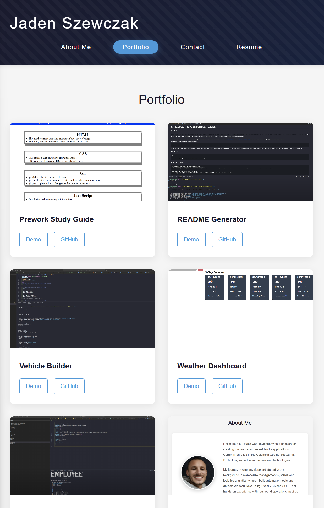

# React Portfolio README

## Description

A professional portfolio built with React showcasing my web development projects and skills. This single-page application features dynamic navigation, project galleries, contact form validation, and a downloadable resume.

## Table of Contents

- [Installation](#installation)
- [Usage](#usage)
- [Features](#features)
- [Technologies](#technologies)
- [Screenshots](#screenshots)
- [Deployment](#deployment)
- [Contact](#contact)

## Installation

```bash
git clone https://github.com/jadenszewczak/react-portfolio.git
cd react-portfolio
npm install
```

## Usage

```bash
npm run dev
```

Visit `http://localhost:5173` to view the application.

## Features

- **Single Page Application** with React Router for seamless navigation
- **Responsive Design** that works on all devices
- **Dynamic Project Gallery** showcasing 6 featured projects
- **Contact Form** with real-time validation
- **Downloadable Resume** with technical proficiencies
- **Social Media Links** in footer

## Technologies

- React.js
- React Router
- CSS3 with custom properties
- Vite
- React Icons
- Netlify (deployment)

## Screenshots



## Deployment

Live application: [https://jaden-szewczak-portfolio.netlify.app](https://jaden-szewczak-portfolio.netlify.app)

## Contact

- **Email**: <jaden.szewczak@wakefern.com>
- **GitHub**: [jadenszewczak](https://github.com/jadenszewczak)
- **LinkedIn**: [Jaden Szewczak](https://www.linkedin.com/in/jaden-szewczak-713b20331)

## License

MIT License
